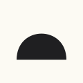
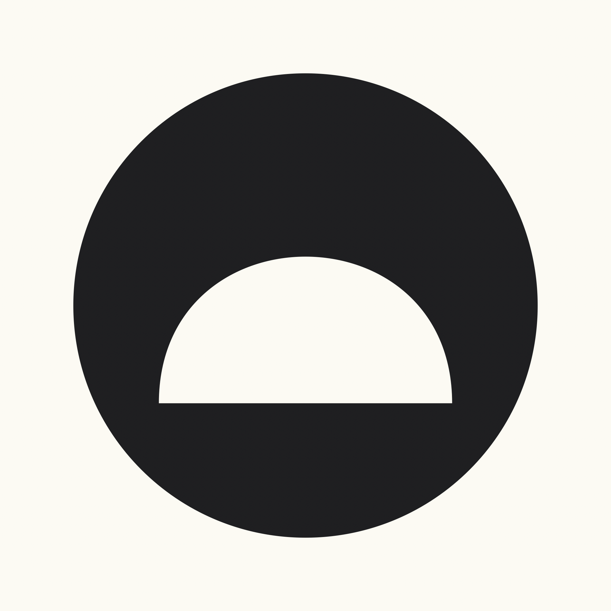
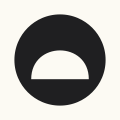
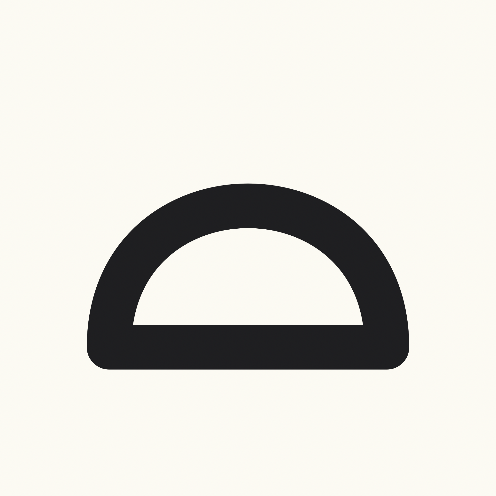
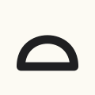

# Sustenance app icon options

The app currently uses **Solid bowl**.

## Solid bowl

**Default app icon. One filled shape on cream paper.**

Small preview (60pt):

## Round mark

**Dark circle with cream bowl cutout.**

Small preview (60pt):

## Stroke bowl

**Single thick outline, no fill.**

Small preview (60pt):

